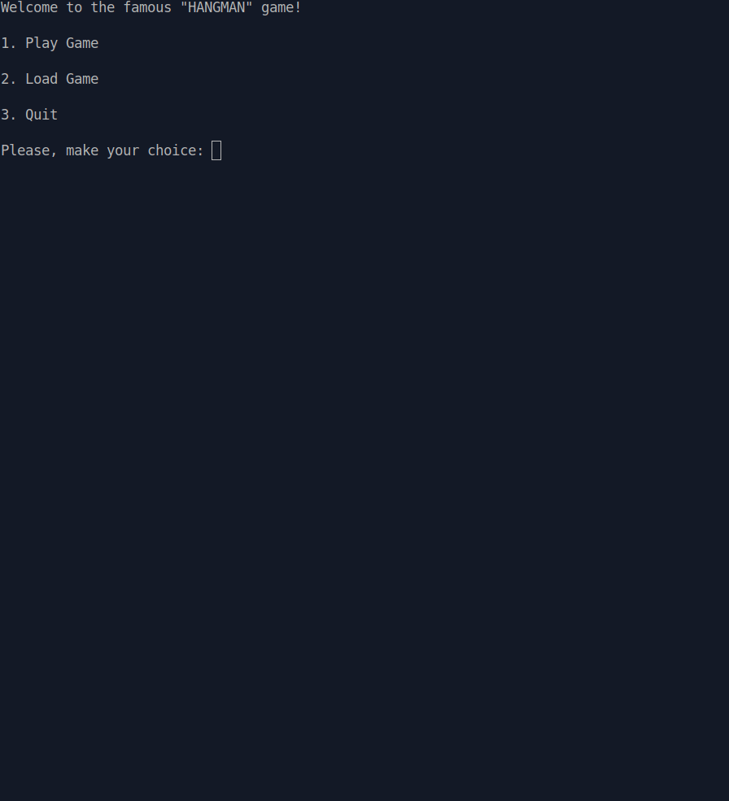

# Project: Hangman

I made this project while running through the Ruby Programming course (Intermediate Ruby: File I/O and Serialization) at The Odin Project. 

Hangman is a quick and simple word guessing game. One player thinks of a word, phrase or sentence and the other tries to guess it by suggesting letters within a certain number of guesses.

If you’re unfamiliar with how Hangman works, see Wikipedia, or go straight to trying out my version [here](http://hangman.pandenok.repl.run/).

### User interface

- CLI — Command Line Applications/Interface

<!--  -->

### Pseudocode

The structure is very similar to [Mastermind](https://github.com/Pandenok/mastermind) game. This time I've split `Player` into two separate classes, IMHO it makes code more scalable for future eventual improvements. So generic building blocks are `Board`, `Host`, `Guesser` and `Game`. 

`Board` class is responsable for hiding the secret word, analysing a guess and, based on this, reveal a guessed letter/word or make a punishment by drawing elements of hangman.

`Game` class is used to structure the game through various menus (play, load, etc.), control the game flow and eventually stop the game when the word is guessed.

`Host` class will be tasked with choosing a word `Guesser` will have to solve. A dictionary must be used to choose words between 5 and 12 characters.

`Guesser` just need to respond to the message `guess`. 

# What I learned

Feeling myself definitely more confident with OOP and actually having much more fun with it.
The main purpose of the project was to give Files and Serialization a shot. Still have some questions, still a lot to learn and go deep but I'm fine for now. 

## Eventual Improvements List

- [ ] Human as Host VS Computer as Guesser
- [ ] stylish secret word as rainbow
- [ ] scoring system
- [ ] make a rule saying that `Guesser`can only guess the secret word once before it loses (makes the game harder)
- [ ] `Host` can also choose phrases (for longer games)
- [ ] `Host` can choose difficult words with uncommon letters, like "z," or "j," and only a few vowels (makes AI smarter)

